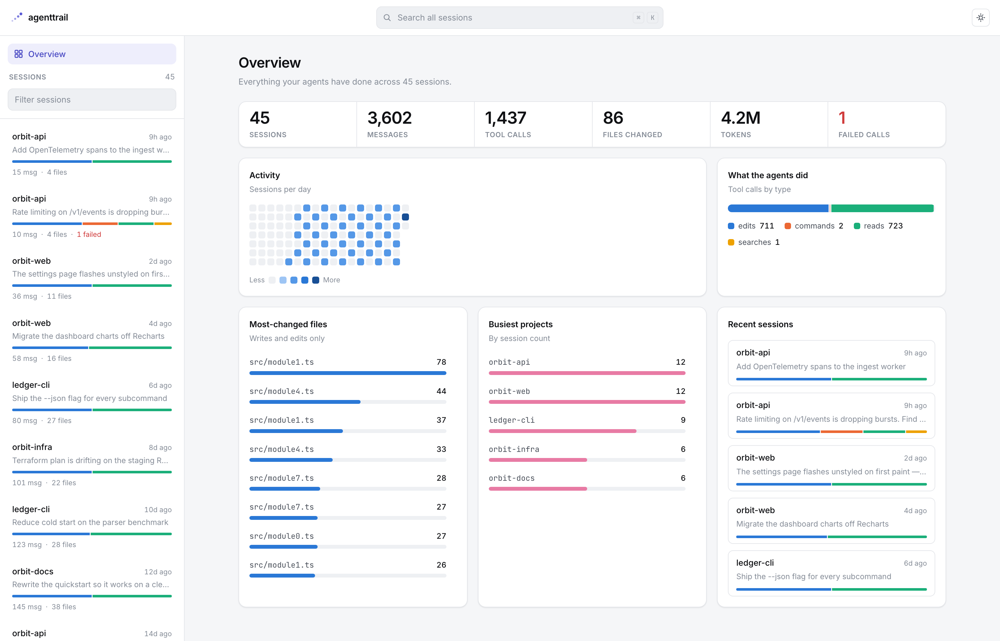

# agenttrail

Local-first CLI + web dashboard for reviewing agent session transcripts.

It reads Claude Code sessions from `~/.claude/projects`, Codex CLI rollouts
from `~/.codex/sessions`, and Cursor workspace chats from Cursor's
workspaceStorage, and turns them into something you can actually
review: sessions, full conversation timelines, every file the agent touched,
every edit it made, and full-text search across all of it.

<!-- badges -->
[](LICENSE)
[](https://nodejs.org)

<p align="center">
  
</p>
<p align="center">
  <sub>Screenshot uses synthetic transcripts, not real sessions.</sub>
</p>

## Quickstart

```bash
npx agenttrail
```

This scans the default transcript roots (`~/.claude/projects`,
`~/.codex/sessions`, Cursor's workspaceStorage, whichever exist), starts a
local server and opens the dashboard in your browser.

```bash
agenttrail --port 3000              # serve on a specific port
agenttrail --dir /path/to/projects  # read Claude Code transcripts from somewhere else
agenttrail --no-open                # don't open the browser
```

Cursor support reads the workspace SQLite state with the `sqlite3` CLI in
read-only mode; if `sqlite3` is not on the PATH, Cursor workspaces are
skipped and everything else keeps working.

## Features

- Overview dashboard: activity heatmap by day, tool mix, most-changed files,
  busiest projects, and totals across every session.
- Per-project dashboard: everything one project's agents did across all its
  sessions, including which files keep coming back.
- Session summary: directories changed, every instruction you gave, every call
  that failed and why, and the files that took the most work. Click any of it
  to jump to that point in the transcript.
- Session view: an activity strip showing the shape of the session over time,
  colored by tool type and notched where calls failed. Click anywhere to jump
  to that moment.
- Agent replies are collapsed by default to a one-line preview with a word
  count. Expand one, or all.
- Transcript timeline: your turns, the agent's replies and tool calls on a
  single spine. Long runs of tool calls collapse into one expandable cluster
  so they don't bury the conversation.
- Session fingerprints: every sidebar row carries a small bar of its
  edit/command/read mix, so the list reads as shapes rather than text.
- Project filter: narrow the sidebar session list to one or several projects,
  and clear it again in one click.
- Files touched: every file created, edited or read, ranked by how often.
- Full-text search: `⌘K` from anywhere, arrow keys and Enter to jump.
- Token usage: per-session input/output totals, deduplicated across streaming
  chunks, with cache reads reported separately so they don't inflate the
  headline number.
- Live tail: while a session is still being written, the open session and the
  sidebar update in place over SSE, no refresh needed.
- Custom sources: add your own transcript folders from the gear popover in
  the top bar. They are remembered, scanned alongside the defaults, and
  watched live like any built-in root. Removal only edits the config file.
- No database, no accounts. Parses transcripts directly, streams line by
  line, tolerates malformed data.

## How it works

Claude Code stores each session as a JSONL transcript at
`~/.claude/projects/<slugified-cwd>/<session-uuid>.jsonl`, and Codex CLI at
`~/.codex/sessions/<yyyy>/<mm>/<dd>/rollout-*.jsonl`. Cursor keeps one SQLite
database per workspace in its workspaceStorage directory. agenttrail parses
each format with a per-provider reader, normalizes the events (`user` /
`assistant` messages, tool calls, token usage where the provider records it)
into one compact model, and serves it over a small local HTTP API to a React
dashboard. Nothing leaves your machine.

Extra transcript folders can be added from the dashboard (the gear in the top
bar) or by hand in `~/.agenttrail/config.json` (`AGENTTRAIL_CONFIG` overrides
the location):

```json
{
  "roots": [
    { "path": "/Volumes/backup/claude-transcripts", "provider": "auto", "label": "backup drive" }
  ]
}
```

`provider` is `claude`, `codex`, `cursor` or `auto` (sniff the layout). Each
entry is deduplicated against the built-in roots, scanned at startup, and
watched live like any other root. A missing or corrupt config file just means
no extra roots.

## Privacy

agenttrail is fully local. Your transcripts are read from disk, served to
`localhost`, and never sent anywhere. No telemetry, no analytics, no network
calls.

## Roadmap

- [x] Cursor / Codex / other agent transcript ingestion
- [ ] Cost sidebar (per-session $ estimates)
- [x] Diff view for Edit/MultiEdit operations
- [ ] Optional cloud sync / team sharing
- [x] Live tail of in-progress sessions

## Development

```bash
npm install
npm --prefix web install
npm run build        # builds CLI (tsc) + dashboard (vite)
node dist/cli.js     # run it
npm run dev:web      # vite dev server, proxies /api to :4820
npm test             # parser + search tests (node:test, no test deps)
```

The tests mostly cover the parser edge cases that come from a schema we don't
control: streaming assistant chunks that share one `message.id` (which must
not double-count tokens), `tool_result` blocks folded back into their
`tool_use`, orphaned results from truncated transcripts, and malformed lines.

Stack: TypeScript, Node's built-in `http` (zero runtime dependencies for the
CLI), React + Vite + Tailwind for the dashboard.

### Design

The UI follows [`DESIGN.md`](DESIGN.md). Short version: light-first, grey page
with white cards, one brand accent used only for identity and selection, and
five fixed category colors for tool activity. The same hue means the same
thing in the sidebar fingerprint, the overview mix bar, the session strip and
every tool row in the transcript.

Chart colors come from a palette validated for colorblind separation and
contrast against this app's actual surfaces (`#ffffff` light, `#1c1d21`
dark). Re-run the validator before changing any of them. Three light slots
sit under 3:1 contrast by design, which is why every colored mark in the UI
ships next to a visible text label carrying its value.

## Contributing

See [`CONTRIBUTING.md`](CONTRIBUTING.md). Short version: issues first for
anything big, tests for parser changes, no new runtime deps for the CLI.

## License

[MIT](LICENSE)
